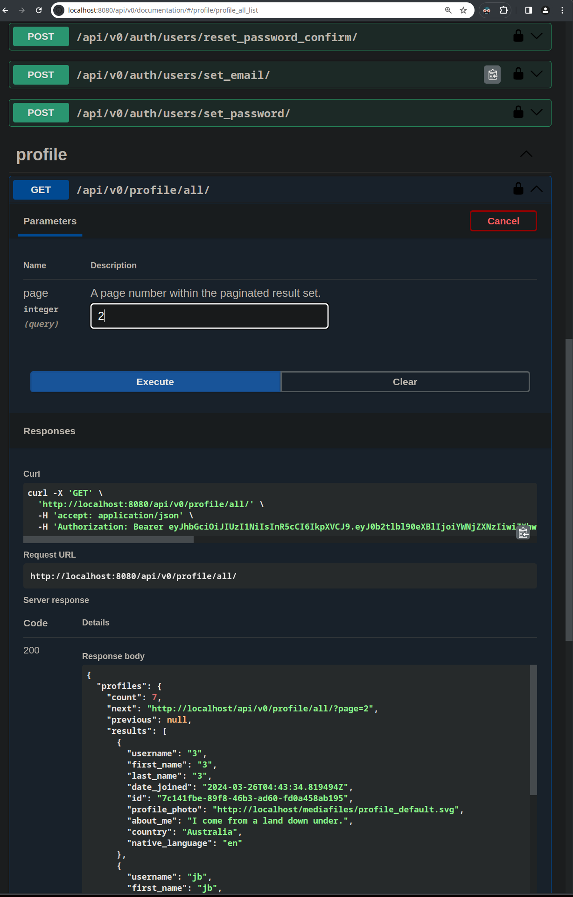
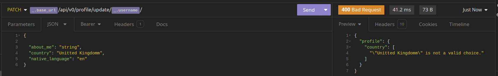

## Project Goals

## Technology Used

## Design Choices

### Database: Postgres
**Why chosen?:** I wanted practice with relational data bases and was most familiar with Postgres.

### SwaggerAPI 
**Why chosen?:** Easy documentation. End points can be extracted for use in Insomnia by importing .yaml file. Type safety introduced with **openapi-fetch**.

Sample of documentation

Shows usage of imported API yaml for testing purpose

### Typescript Frontend

### Django Backend
The main reason was to program in a language that I am familiar with and I wanted to be different from the Frontend for the sake of working with more than one language. I chose Python. This allows me to use libraries I am familiar with such as Pandas. 

Things I would do differently include using a fast running compiled language such as Go for api requests.

### Rest API

### Authentication using JWT

**Why Chosen** - wanted to learn more about jwts based authentication

**How Implemented** - 

**downsides** 
- not as secure as <????????>  
- frequent token update lead to more traffic on network

## Docker and Docker-compose
- Standard reasons - allows easy CI, consistent environment for deployment and development across machines.
-  Areas for improvement - currently build model does not allow for easy access across multiple machines, as can be achieved using something like docker storm or Kubernetes
  

### Make files

country-code-lookup
https://www.npmjs.com/package/langs

### Forms
use uncontrolled value in favor of controlled values except where seen as beneficial

### Boiler Plate code
much of the boiler plate for this project comes form the following sources
Most of the basic structure for the Django backend is taken from here

### database choices
- uuids for ids, prevent scraping attacks

### Translations through dictionary files 

### Translations through API

### Dictionary through API

Dictionary definitions come from wiktionary's api. As this is a public endpoint, and there is no desire to hide the logic, the API is called out from the client side to reduce load on the server and for faster response times.

The English Wiktionary Documentation is linked below. The language code is given in the bottom level domain. 

[https://en.wiktionary.org/api/rest_v1/#/Page%20content/get_page_definition__term_](https://en.wiktionary.org/api/rest_v1/#/Page%20content/get_page_definition__term_)

This is very limited outside of the English language. Other API are fairly limited for the free tier, but can easily be added is this ever becomes more than a hobby project. 

