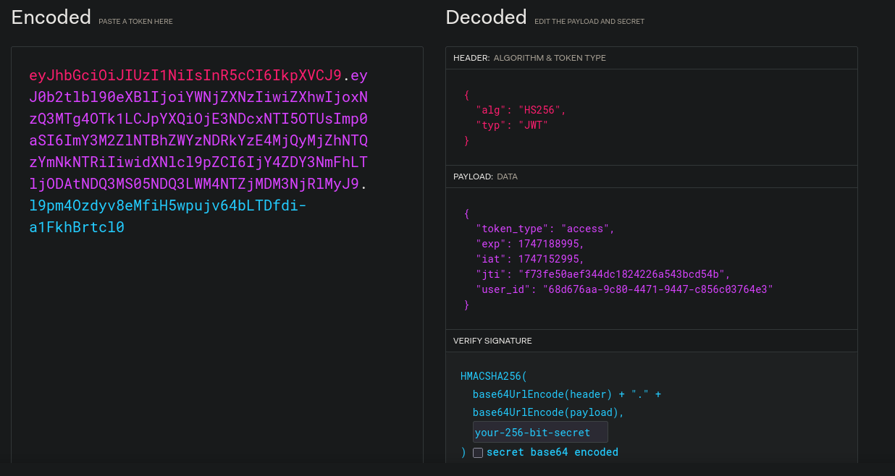
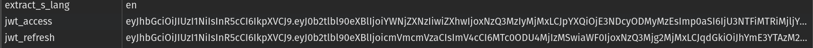
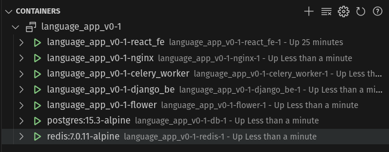

## Project Description
## Project Goals

The primary goal of this project is for the sake of learning.

The secondary goal if to create a tool that I have not seen, that is useful for me and that others will be able to find value in as well.


<!--  Create links for each of these to appropriate sections -->
## Technology Used 
- SQL (postgres) with Django ORM
- Python (scripting, backend)
- Nginx ( reverse proxy)
- Typescript/ React frontend
- Message queues - (Celery with Redis)
- Github Actions - for CI pipelines


## Demonstrates usage of the following concepts
- Creation of CRUD REST APIs
- Unit testing
- JWT based authentication
- Transactional database operations and database querying
- Consuming of several external API, both on the client and server sides, where most appropriate
- Logging
- CI pipeline
- Code analysis tools, formatting,
- Design choices based on pricing and usability
- debugger usage
- Containers

## Design Choices

### Database: Postgres
**Why SQL?:** The basic reasoning is that I wanted to work with SQL for the practice. It also has benefits in systems that are more read intensive than a no SQL database such as MongoDB.

**Why Postgres** - I have worked with postgres in the past and I am most familiar with this flavor of SQL

### Python
I am familiar with python and wanted to be able to move faster without learning a new language. Python also has good support for some of the libraries that I wanted to use.

### Django 
This appeared to be the most used python framework, for example in comparison to Flask. 


### Nginx
Chosen over Apache due to familiarity

<!-- TODO still need to add these, -->
Mostly serves as a reverse proxy but has a couple limits set up for user usage, such as rate limiting

### SwaggerAPI 
**Why chosen?:** Easy documentation. End points can be extracted for use in Insomnia by importing .yaml file. 

<!-- TODO => still need to incorporate this -->
There are additional benefits in it having the ability to generate types for the typescript front end


### JWT webtokens
I had previously worked with cookie based token and wanted to learn more about them

### React 
It is the Modern front end frame work that I am most familiar with and the one that I see the most in job listings. 


### 


Type safety introduced with **openapi-fetch**.


Sample of documentation


Shows usage of imported API yaml for testing purpose

### Typescript Frontend

- Typescript was chosen over javascript because fake typing is less error prone than no typing and I simply like working in it more, even if it is slower to write in.


### Django Backend
The main reason was to program in a language that I am familiar with and I wanted to be different from the Frontend for the sake of working with more than one language. I chose Python. This allows me to use libraries I am familiar with such as Pandas. 

Things I would do differently include using a fast running compiled language such as Go for api requests.

### Rest API

Implemented using the Django [Rest API framework](https://www.django-rest-framework.org/). This takes care of much of the boiler plate and allows for easy handling of validation errors.

- Most of the endpoints require authentication to access them


### S3 - Static File Storage
<!-- TODO - are the backups there? -->
S3 buckets are used both for backups and for storing media files


### Authentication using JWT

**Why Chosen** - wanted to learn more about jwts based authentication



**How Implemented** - 

<!--  TODO - comment on refresh rate -->

Auth tokens are put into local storage. This is not as secure as <cookie approach?????> , but is sufficient for the purposes of this application.
<!-- TODO - (basing on arguments found here) -->



**downsides** 
- not as secure as <????????>  
- frequent token update lead to more traffic on network

### Docker and Docker-compose
- Standard reasons - allows easy CI, consistent environment for deployment and development across machines.
-  Areas for improvement - currently build model does not allow for easy access across multiple machines, as can be achieved using something like docker storm or Kubernetes

  


### Make Files
Make files and some simple bash aliases were used to make development easier with shortcut names 

### Git Usage

- Git usage is similar to the [Git flow pattern](https://www.atlassian.com/git/tutorials/comparing-workflows/gitflow-workflow), which has separate branches for each feature, merging into a development branch before merging into main.
  

<sub><sup>Image source: Atlassian: https://www.atlassian.com/git/tutorials/comparing-workflows/gitflow-workflow</sup></sub>


country-code-lookup
https://www.npmjs.com/package/langs


### Forms
<!--  explain what this means or get rid of it -->
use uncontrolled value in favor of controlled values except where seen as beneficial 


### Boiler Plate code
much of the boiler plate for this project comes form the following sources
Most of the basic structure for the Django backend is taken from here

### Database comments
- Use of uuids for ids over scraping attack prone incremented ids
- Indexes on common query items
- Transactions where appropriate.


### Data Extraction - word translations and definitions
- Full translations are done client side via a free google translate api
- Quick translations are done client side via the same api
  - to get the words individually, a regex was used and the payload was delimited by newline characters.
- The definitions are extracted using an internal bilingual dictionary API as described below:

### The dictionary API
- Most Multi-lingual dictionary are expensive, especially if calling for thousands of definitions in bulk. For this reason, an internal one was built using data extracted from wicktionary list. This is mostly limited translations to and from english.
- Translations were loaded through parsing files found in this repository <TODO - include repo>, and parsing them with regex and string utils,  <TODO - include link to parsed data here>. The data was loaded into the database by converting them into Django fixtures. See Seeding data <TODO create a link>

### Future dictionary API usage.
- Implementation could be easy, much easier that the approach taken above. Here is one example.<TODO - include example>
- Setting up requests to get data could be expensive if misused and I do not want to include this without setting up safe guards to prevent abuse. This is the primary reason for excluding it.
- API calls on definitions may be limited to just the ones that a user specifically requests. Further more, It would make sense to cache frequent queries. 


### Word Frequency Counts 
Word frequency counts come from this repository. <TODO - include repo>. The original list were converted into django fixtures in order to populate the database.  
Lemmas - While obtaining frequency counts, the Spacy library was used to determine probable lemmas (root words). The frequency of the lemmas were also calculated. 
- Lemmas to words could also be determined by an LLM, however, this may still be error prone one less common languages. Another approach could be to have volunteers on contractors correct the lemmas for the more common words.
- There is an API endpoint for this, as described below.


### Seeding the database:
Database was seeded with:
    - Word/lemma frequency counts for common languages
    - Dictionary API definitions
    - Language word lists
    run command to load fixtures
    ```docker compose -f docker-compose.dev.yml exec django_be python3 manage.py loaddata word_freq_fixture dict_item_fixture```


### Translations through dictionary files 


### Rest API
    - Idempotency of PUT, PACTH, POST requests
    - HTTP status code with useful messages
    


### Dictionary through API

Dictionary definitions come from wiktionary's api. As this is a public endpoint, and there is no desire to hide the logic, the API is called out from the client side to reduce load on the server and for faster response times.

The English Wiktionary Documentation is linked below. The language code is given in the bottom level domain. 

[https://en.wiktionary.org/api/rest_v1/#/Page%20content/get_page_definition__term_](https://en.wiktionary.org/api/rest_v1/#/Page%20content/get_page_definition__term_)


This is very limited outside of the English language. Other API are fairly limited for the free tier, but can easily  be added is this ever becomes more than a hobby project.  

### Word Statistics API
- 


## Features

## Navigator (cmd line)
Pressing escape allows for quickly navigating between pages. Important pages are quickly accessible, as are the dictionary and translation modals. The original intention was to include commands such as "d? \<word to define\> to use a dictionary feature, but this is not yet implemented.


## Dictionary Modal:

This is a dictionary service using the Wikitionary API. One downside to this is that the definitions returned are all in English. While this could be a limitation for the users seeking a different language, the service is free and can be done client side without any strain on the server.

<!-- TODO -  include screenshot -->


## Translation Modal:

The modal is easily accessible from the keyboard without the need to use a mouse. This uses a public Google translate endpoint that is done client side. There is also a link to open a google translate page with user input string imputed. 
<!-- TODO include screenshot -->

## Data extraction -- Text

The user is able to enter a string of information and get translation of all the words present in the text

<!-- TODO include screenshot -->

### Logging 
- logging of unexpected server errors or other items of interest
<!-- Show image of docker logs  maybe with grep command-->

### Toast messages Alerting Users of errors and actions 
- Notifications and error messages normally pop up as Toast messages.
- System specific errors ase obfuscated as it is bad practice to do so, even if the code is found in a public repo. 

### Error handling
- System errors are logged where relevant.
- Feedback is often provided to users to client errors, misformed payloads, bad connections and similar situations.

### Celery as a message queue
- Used for a few asynchronous tasks, such as sending emails to confirm signing up for the application.

### Local storage 
- Used to keep track of some persistent data


### Tools utilized
- Insomnia -  <todo - provide link> - for api endpoint testing.
- The debugger - <add that in>
- Developer tools, React developer tools, 
## Learning Outcomes


